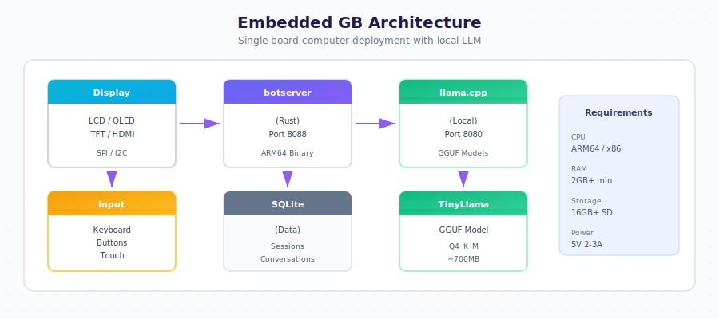

# Chapter 13: Device & Offline Deployment

Deploy General Bots to any device - from smartphones to Raspberry Pi to industrial kiosks - with local LLM inference for fully offline AI capabilities.

## Overview

General Bots can run on any device, from mobile phones to minimal embedded hardware with displays as small as 16x2 character LCDs, enabling AI-powered interactions anywhere:

- **Kiosks** - Self-service terminals in stores, airports, hospitals
- **Industrial IoT** - Factory floor assistants, machine interfaces
- **Smart Home** - Wall panels, kitchen displays, door intercoms
- **Retail** - Point-of-sale systems, product information terminals
- **Education** - Classroom assistants, lab equipment interfaces
- **Healthcare** - Patient check-in, medication reminders

## What's in This Chapter

### Mobile Deployment
- [Mobile (Android & HarmonyOS)](./mobile.md) - BotOS for smartphones and tablets

### Embedded Deployment  
- [Supported Hardware](./hardware.md) - SBCs, displays, and peripherals
- [Quick Start](./quick-start.md) - Deploy in 5 minutes
- [Local LLM](./local-llm.md) - Offline AI with llama.cpp
- [Buying Guide](./buying-guide.md) - Choose your first SBC

### Robotics
- [Humanoid Robots](./humanoid.md) - Build intelligent humanoids with CV, LLM, and movement control

### Deployment Options

| Platform | Use Case | Requirements |
|----------|----------|--------------|
| **Android/HarmonyOS** | Smartphones, tablets, kiosks | Any Android 8+ device |
| **Raspberry Pi** | IoT, displays, terminals | 1GB+ RAM |
| **Orange Pi** | Full offline AI | 4GB+ RAM for LLM |
| **Industrial** | Factory, retail, healthcare | Any ARM/x86 SBC |
| **Humanoid Robots** | Service, reception, research | Servo kit + compute board |
