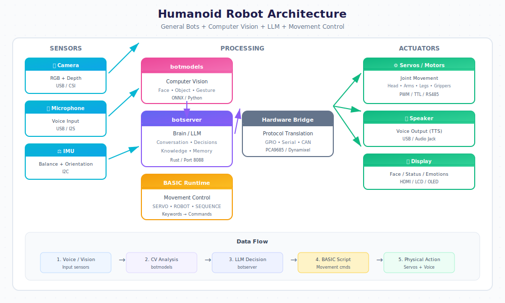

# Humanoid Robotics with General Bots

Build custom humanoid robots powered by General Bots, using computer vision from botmodels, LLM intelligence from botserver, and BASIC keywords for movement control.

## Overview

General Bots transforms humanoid robot kits into intelligent conversational assistants capable of:

- **Natural conversation** via LLM integration
- **Visual recognition** using botmodels CV pipelines
- **Expressive movement** through BASIC keyword commands
- **Autonomous behavior** with scheduled tasks and triggers



## Supported Robot Kits

### Consumer Kits

| Kit | DOF | Height | Price | Best For |
|-----|-----|--------|-------|----------|
| **Unitree G1** | 23 | 127cm | $16,000 | Research, commercial |
| **Unitree H1** | 19 | 180cm | $90,000 | Industrial, research |
| **UBTECH Walker S** | 41 | 145cm | Contact | Enterprise service |
| **Fourier GR-1** | 40 | 165cm | $100,000+ | Research |
| **Agility Digit** | 16 | 175cm | Lease | Warehouse, logistics |

### DIY/Maker Kits

| Kit | DOF | Height | Price | Best For |
|-----|-----|--------|-------|----------|
| **Poppy Humanoid** | 25 | 83cm | $8,000 | Education, research |
| **InMoov** | 22+ | 170cm | $1,500+ | Makers, open source |
| **Reachy** | 14 | Torso | $15,000 | HRI research |
| **NimbRo-OP2X** | 20 | 95cm | $30,000 | RoboCup, research |
| **ROBOTIS OP3** | 20 | 51cm | $11,000 | Education, competition |

### Affordable Entry Points

| Kit | DOF | Height | Price | Best For |
|-----|-----|--------|-------|----------|
| **ROBOTIS MINI** | 16 | 27cm | $500 | Learning, hobby |
| **Lynxmotion SES-V2** | 17 | 40cm | $800 | Education |
| **Hiwonder TonyPi** | 16 | 35cm | $400 | Raspberry Pi projects |
| **XGO-Mini** | 12 | 20cm | $350 | Quadruped + arm |

## Architecture

### System Components

| Component | Role | Technology |
|-----------|------|------------|
| **botserver** | Brain - LLM, conversation, decisions | Rust, Port 8088 |
| **botmodels** | Eyes - CV, face recognition, object detection | Python, ONNX |
| **BASIC Runtime** | Motor control - movement sequences | Keywords → servo commands |
| **Hardware Bridge** | Translation layer | GPIO, Serial, CAN bus |

### Communication Flow

| Step | From | To | Protocol |
|------|------|----|----------|
| 1 | Microphone | botserver | Audio stream / STT |
| 2 | botserver | LLM | HTTP API |
| 3 | LLM response | BASIC interpreter | Internal |
| 4 | BASIC keywords | Hardware bridge | Serial/GPIO |
| 5 | Hardware bridge | Servos | PWM/CAN |
| 6 | Camera | botmodels | Video stream |
| 7 | botmodels | botserver | Detection events |

## Hardware Setup

### Computing Options

| Option | Specs | Use Case |
|--------|-------|----------|
| **Jetson Orin Nano** | 8GB, 40 TOPS | Full CV + local LLM |
| **Raspberry Pi 5** | 8GB, no NPU | Cloud LLM, basic CV |
| **Orange Pi 5** | 8GB, 6 TOPS NPU | Local LLM, basic CV |
| **Intel NUC** | 32GB, x86 | Maximum performance |

### Servo Controllers

| Controller | Channels | Interface | Best For |
|------------|----------|-----------|----------|
| **PCA9685** | 16 PWM | I2C | Small robots |
| **Pololu Maestro** | 6-24 | USB/Serial | Hobby servos |
| **Dynamixel U2D2** | 254 | USB/TTL/RS485 | Dynamixel servos |
| **ODrive** | 2 BLDC | USB/CAN | High-torque joints |

### Sensor Integration

| Sensor | Purpose | Interface |
|--------|---------|-----------|
| USB Camera | Vision, face detection | USB/CSI |
| IMU (MPU6050) | Balance, orientation | I2C |
| ToF (VL53L0X) | Distance sensing | I2C |
| Microphone Array | Voice input, direction | USB/I2S |
| Force Sensors | Grip feedback | ADC |

## BASIC Keywords for Robotics

### Servo Control

```basic
' Initialize servo controller
SERVO INIT "PCA9685", address: 0x40

' Move single servo
SERVO MOVE channel, angle, speed
SERVO MOVE 0, 90, 50      ' Channel 0 to 90° at speed 50

' Move multiple servos simultaneously
SERVO SYNC moves
SERVO SYNC [[0, 90], [1, 45], [2, 135]]

' Read servo position
position = SERVO READ channel
```

### Predefined Movements

```basic
' Humanoid poses
ROBOT POSE "stand"
ROBOT POSE "sit"
ROBOT POSE "wave"
ROBOT POSE "bow"
ROBOT POSE "point", direction: "left"

' Walking
ROBOT WALK steps, direction
ROBOT WALK 5, "forward"
ROBOT WALK 3, "backward"
ROBOT TURN degrees
ROBOT TURN 90      ' Turn right 90°
ROBOT TURN -45     ' Turn left 45°

' Arm movements
ROBOT ARM "left", action: "raise"
ROBOT ARM "right", action: "extend"
ROBOT GRIP "left", "open"
ROBOT GRIP "right", "close"

' Head movements
ROBOT HEAD "nod"
ROBOT HEAD "shake"
ROBOT HEAD "look", pan: 30, tilt: -15
```

### Motion Sequences

```basic
' Define custom sequence
SEQUENCE DEFINE "greeting"
    ROBOT POSE "stand"
    WAIT 500
    ROBOT HEAD "look", pan: 0, tilt: 0
    ROBOT ARM "right", action: "wave"
    WAIT 1000
    ROBOT POSE "bow"
    WAIT 800
    ROBOT POSE "stand"
SEQUENCE END

' Play sequence
SEQUENCE PLAY "greeting"

' Interrupt sequence
SEQUENCE STOP
```

### Balance and Safety

```basic
' Enable balance control
ROBOT BALANCE ON
ROBOT BALANCE OFF

' Set safety limits
ROBOT LIMITS torque: 80, speed: 70

' Emergency stop
ROBOT STOP

' Check stability
stable = ROBOT STABLE
IF NOT stable THEN
    ROBOT POSE "stable"
END IF
```

## Computer Vision Integration

### Face Detection and Recognition

```basic
' Start face detection
CV START "face_detection"

' Wait for face
face = CV DETECT "face", timeout: 5000

IF face THEN
    ' Get face details
    name = face.identity
    emotion = face.emotion
    direction = face.direction
    
    ' React to person
    ROBOT HEAD "look", pan: direction.x, tilt: direction.y
    
    IF name <> "unknown" THEN
        TALK "Hello " + name + "!"
        SEQUENCE PLAY "greeting"
    ELSE
        TALK "Hello! I don't think we've met."
    END IF
END IF
```

### Object Detection

```basic
' Detect objects in view
objects = CV DETECT "objects"

FOR EACH obj IN objects
    IF obj.class = "cup" THEN
        ' Point at the cup
        ROBOT ARM "right", action: "point"
        ROBOT HEAD "look", pan: obj.x, tilt: obj.y
        TALK "I see a " + obj.color + " cup"
    END IF
NEXT
```

### Gesture Recognition

```basic
' Enable gesture detection
CV START "gesture_detection"

' React to gestures
gesture = CV DETECT "gesture", timeout: 10000

SELECT CASE gesture.type
    CASE "wave"
        SEQUENCE PLAY "wave_back"
    CASE "thumbs_up"
        ROBOT POSE "thumbs_up"
        TALK "Great!"
    CASE "come_here"
        ROBOT WALK 3, "forward"
    CASE "stop"
        ROBOT STOP
END SELECT
```

### Following Behavior

```basic
' Follow a person
CV START "person_tracking"

WHILE TRUE
    person = CV TRACK "person"
    
    IF person THEN
        ' Keep person centered
        IF person.x < -20 THEN
            ROBOT TURN -10
        ELSE IF person.x > 20 THEN
            ROBOT TURN 10
        END IF
        
        ' Maintain distance
        IF person.distance < 1.0 THEN
            ROBOT WALK 1, "backward"
        ELSE IF person.distance > 2.0 THEN
            ROBOT WALK 1, "forward"
        END IF
    ELSE
        ' Lost tracking, look around
        ROBOT HEAD "look", pan: 45, tilt: 0
        WAIT 1000
        ROBOT HEAD "look", pan: -45, tilt: 0
        WAIT 1000
    END IF
    
    WAIT 100
WEND
```

## LLM-Driven Behavior

### Conversational Movement

```basic
' System prompt for embodied AI
system_prompt = "You are a helpful humanoid robot assistant. "
system_prompt = system_prompt + "When responding, include movement commands in brackets. "
system_prompt = system_prompt + "Available: [wave], [nod], [shake_head], [bow], [point_left], [point_right], [think]"

SET SYSTEM PROMPT system_prompt

' Process conversation with movements
response = LLM "How can I help you today?"

' Parse and execute movements
movements = EXTRACT_BRACKETS response
FOR EACH move IN movements
    SELECT CASE move
        CASE "wave"
            SEQUENCE PLAY "wave"
        CASE "nod"
            ROBOT HEAD "nod"
        CASE "shake_head"
            ROBOT HEAD "shake"
        CASE "bow"
            ROBOT POSE "bow"
        CASE "point_left"
            ROBOT ARM "left", action: "point"
        CASE "point_right"
            ROBOT ARM "right", action: "point"
        CASE "think"
            ROBOT HEAD "look", pan: 15, tilt: 15
    END SELECT
NEXT

' Speak cleaned response
clean_response = REMOVE_BRACKETS response
TALK clean_response
```

### Autonomous Behavior Loop

```basic
' Main behavior loop
WHILE TRUE
    ' Check for voice input
    input = HEAR timeout: 5000
    
    IF input <> "" THEN
        ' Process with LLM
        response = LLM input
        ProcessResponse response
    ELSE
        ' Idle behaviors
        idle_action = RANDOM 1, 5
        
        SELECT CASE idle_action
            CASE 1
                ' Look around
                ROBOT HEAD "look", pan: RANDOM -30, 30, tilt: 0
            CASE 2
                ' Check for faces
                face = CV DETECT "face", timeout: 1000
                IF face THEN
                    TALK "Hello there!"
                    SEQUENCE PLAY "greeting"
                END IF
            CASE 3
                ' Slight movement
                ROBOT POSE "relax"
            CASE 4, 5
                ' Do nothing
        END SELECT
    END IF
    
    WAIT 1000
WEND
```

## Configuration

### Robot Definition File

Create `robot.csv` in your `.gbot` folder:

| name | value |
|------|-------|
| robot_type | humanoid |
| controller | PCA9685 |
| controller_address | 0x40 |
| servo_count | 16 |
| balance_enabled | true |
| cv_enabled | true |
| cv_model | yolov8n |
| face_model | arcface |

### Servo Mapping

Create `servos.csv` to map joints to channels:

| joint | channel | min_angle | max_angle | home | inverted |
|-------|---------|-----------|-----------|------|----------|
| head_pan | 0 | -90 | 90 | 0 | false |
| head_tilt | 1 | -45 | 45 | 0 | false |
| left_shoulder | 2 | -90 | 180 | 0 | false |
| left_elbow | 3 | 0 | 135 | 90 | false |
| left_wrist | 4 | -90 | 90 | 0 | false |
| right_shoulder | 5 | -90 | 180 | 0 | true |
| right_elbow | 6 | 0 | 135 | 90 | true |
| right_wrist | 7 | -90 | 90 | 0 | true |
| left_hip | 8 | -45 | 45 | 0 | false |
| left_knee | 9 | 0 | 90 | 0 | false |
| left_ankle | 10 | -30 | 30 | 0 | false |
| right_hip | 11 | -45 | 45 | 0 | true |
| right_knee | 12 | 0 | 90 | 0 | true |
| right_ankle | 13 | -30 | 30 | 0 | true |
| left_grip | 14 | 0 | 90 | 0 | false |
| right_grip | 15 | 0 | 90 | 0 | false |

### Motion Files

Create `motions.csv` for predefined sequences:

| name | frames |
|------|--------|
| wave | [{"t":0,"joints":{"right_shoulder":90}},{"t":500,"joints":{"right_shoulder":120}},{"t":1000,"joints":{"right_shoulder":90}}] |
| bow | [{"t":0,"joints":{"head_tilt":0}},{"t":500,"joints":{"head_tilt":-30}},{"t":1500,"joints":{"head_tilt":0}}] |
| nod | [{"t":0,"joints":{"head_tilt":0}},{"t":200,"joints":{"head_tilt":-15}},{"t":400,"joints":{"head_tilt":10}},{"t":600,"joints":{"head_tilt":0}}] |

## Build Guides

### Beginner: Desktop Companion

**Budget: ~$600**

| Component | Model | Price |
|-----------|-------|-------|
| Robot Kit | ROBOTIS MINI | $500 |
| Compute | Raspberry Pi 5 4GB | $60 |
| Camera | Pi Camera v3 | $25 |
| Microphone | USB mic | $15 |

**Capabilities:**
- Voice conversation via cloud LLM
- Basic face detection
- Gesture responses
- Desktop assistant

### Intermediate: Service Robot

**Budget: ~$10,000**

| Component | Model | Price |
|-----------|-------|-------|
| Robot Kit | Poppy Humanoid | $8,000 |
| Compute | Jetson Orin Nano | $500 |
| Camera | Intel RealSense D435 | $300 |
| Microphone | ReSpeaker Array | $100 |
| Speakers | USB powered | $50 |

**Capabilities:**
- Local LLM (Llama 3.2 3B)
- Full body tracking
- Object manipulation
- Walking and navigation

### Advanced: Research Platform

**Budget: ~$20,000+**

| Component | Model | Price |
|-----------|-------|-------|
| Robot Kit | Unitree G1 EDU | $16,000 |
| Compute | Onboard + Workstation | $3,000 |
| Sensors | LiDAR + Depth cameras | $1,000 |

**Capabilities:**
- Full autonomous navigation
- Complex manipulation
- Multi-modal interaction
- Research-grade motion control

## Safety Considerations

### Physical Safety

- Always have emergency stop accessible
- Set conservative torque limits initially
- Test movements at reduced speed first
- Ensure stable base before walking
- Keep clear area around robot

### Software Safety

```basic
' Always wrap motion code in error handling
ON ERROR GOTO SafetyStop

' Motion code here...

END

SafetyStop:
    ROBOT STOP
    ROBOT POSE "safe"
    LOG ERROR "Emergency stop: " + ERROR MESSAGE
    TALK "I need to stop for safety"
```

### Operating Guidelines

| Situation | Action |
|-----------|--------|
| Unknown obstacle detected | Stop, assess, navigate |
| Balance threshold exceeded | Widen stance or sit |
| Person too close | Step back, warn verbally |
| Battery low | Announce, return to charger |
| Communication lost | Safe pose, wait for reconnect |

## Example: Reception Robot

Complete example of a reception desk humanoid:

```basic
' reception-robot.bas
' A humanoid reception assistant

' Initialize systems
SERVO INIT "PCA9685", address: 0x40
CV START "face_detection"
ROBOT POSE "stand"
ROBOT BALANCE ON

' Set personality
SET SYSTEM PROMPT "You are a friendly reception robot at TechCorp. "
SET SYSTEM PROMPT SYSTEM PROMPT + "Greet visitors, answer questions about the company, "
SET SYSTEM PROMPT SYSTEM PROMPT + "and direct them to the right department. "
SET SYSTEM PROMPT SYSTEM PROMPT + "Be warm and professional. Use [wave], [nod], [point_left], [point_right] for gestures."

' Load company knowledge
USE KB "company-info"

' Main loop
WHILE TRUE
    ' Watch for approaching people
    face = CV DETECT "face", timeout: 2000
    
    IF face THEN
        ' Turn to face person
        ROBOT HEAD "look", pan: face.direction.x, tilt: face.direction.y
        
        ' Check if known
        IF face.identity <> "unknown" THEN
            TALK "Welcome back, " + face.identity + "!"
            SEQUENCE PLAY "wave"
        ELSE
            TALK "Hello! Welcome to TechCorp. How can I help you today?"
            SEQUENCE PLAY "greeting"
        END IF
        
        ' Enter conversation mode
        ConversationLoop
    END IF
    
    ' Idle animation
    IdleBehavior
    
    WAIT 500
WEND

SUB ConversationLoop
    silence_count = 0
    
    WHILE silence_count < 3
        input = HEAR timeout: 10000
        
        IF input <> "" THEN
            silence_count = 0
            
            ' Process with LLM
            response = LLM input
            
            ' Execute gestures
            ExecuteGestures response
            
            ' Speak response
            TALK REMOVE_BRACKETS response
            
            ' Check for directions
            IF CONTAINS response, "point_left" THEN
                TALK "The elevators are to your left"
            ELSE IF CONTAINS response, "point_right" THEN
                TALK "You'll find that department to your right"
            END IF
        ELSE
            silence_count = silence_count + 1
            
            IF silence_count = 2 THEN
                TALK "Is there anything else I can help with?"
                ROBOT HEAD "tilt", angle: 10
            END IF
        END IF
    WEND
    
    TALK "Have a great day!"
    SEQUENCE PLAY "wave"
END SUB

SUB IdleBehavior
    action = RANDOM 1, 10
    
    SELECT CASE action
        CASE 1
            ROBOT HEAD "look", pan: RANDOM -20, 20, tilt: 0
        CASE 2
            ROBOT POSE "relax"
        CASE 3, 4, 5, 6, 7, 8, 9, 10
            ' Mostly stay still
    END SELECT
END SUB

SUB ExecuteGestures response
    IF CONTAINS response, "[wave]" THEN
        SEQUENCE PLAY "wave"
    END IF
    IF CONTAINS response, "[nod]" THEN
        ROBOT HEAD "nod"
    END IF
    IF CONTAINS response, "[point_left]" THEN
        ROBOT ARM "left", action: "point"
    END IF
    IF CONTAINS response, "[point_right]" THEN
        ROBOT ARM "right", action: "point"
    END IF
END SUB
```

## Resources

### Robot Kits

- [Unitree Robotics](https://www.unitree.com/) - G1, H1 humanoids
- [ROBOTIS](https://www.robotis.com/) - OP3, MINI, Dynamixel
- [Poppy Project](https://www.poppy-project.org/) - Open source humanoid
- [InMoov](https://inmoov.fr/) - 3D printable humanoid
- [Pollen Robotics](https://www.pollen-robotics.com/) - Reachy

### Components

- [Dynamixel](https://www.robotis.us/dynamixel/) - Smart servos
- [ODrive](https://odriverobotics.com/) - BLDC motor control
- [Intel RealSense](https://www.intelrealsense.com/) - Depth cameras
- [NVIDIA Jetson](https://developer.nvidia.com/embedded/jetson-modules) - Edge AI

### Learning

- [ROS 2 Humanoid](https://docs.ros.org/) - Robot Operating System
- [MoveIt](https://moveit.ros.org/) - Motion planning
- [OpenCV](https://opencv.org/) - Computer vision
- [MediaPipe](https://mediapipe.dev/) - Body/hand tracking