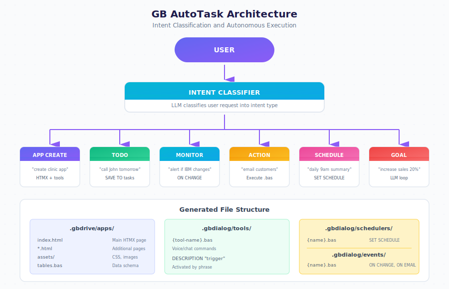

# Autonomous Tasks

Build complete applications through natural conversation. Describe what you want, and the system creates it automatically.

The AutoTask system uses an LLM-powered intent classifier to understand your request and route it to the appropriate handler. Whether you need a full web application, a simple reminder, or automated monitoring, you describe it in plain language.

---

## Intent Types

| Type | Example | What Gets Created |
|------|---------|-------------------|
| `APP_CREATE` | "create app for clinic" | HTMX pages, tools, schedulers |
| `TODO` | "call John tomorrow" | Task saved to tasks table |
| `MONITOR` | "alert when IBM changes" | ON CHANGE event handler |
| `ACTION` | "email all customers" | Executes immediately |
| `SCHEDULE` | "daily 9am summary" | SET SCHEDULE automation |
| `GOAL` | "increase sales 20%" | Autonomous LLM loop with metrics |
| `TOOL` | "when I say X, do Y" | Voice/chat command |

---

## Quick Start

  

    

      
Create an app for my clinic

      
10:30

    

  

  

    

      
<strong>Done:</strong>

      
patients table created

      
appointments table created

      
App available at /apps/clinic

      
10:31

    

  

---

## Architecture Overview

One bot equals one database. All applications within a bot share the same data tables, tools, and schedulers.

---

## File Structure

| Path | Description |
|------|-------------|
| `.gbdrive/apps/{name}/` | Generated web application |
| `.gbdrive/apps/{name}/index.html` | Main HTMX page |
| `.gbdrive/apps/{name}/assets/` | CSS, images |
| `.gbdialog/tables.bas` | Database schema definitions |
| `.gbdialog/tools/` | Voice and chat commands |
| `.gbdialog/schedulers/` | Timed automations |
| `.gbdialog/events/` | Event triggers (ON CHANGE, ON EMAIL) |

---

## Creating an Application

  

    

      
I need an app to track customers and orders

      
10:30

    

  

  

    

      
<strong>Done:</strong>

      
customers table created

      
orders table created

      
App available at /apps/store

      
10:31

    

  

---

## Modifying Your Application

Use Designer to change anything about your app through conversation.

  

    

      
Add a phone field to customers

      
14:20

    

  

  

    

      
Phone field added to customers table.

      
14:20

    

  

  

    

      
Change the submit button to blue

      
14:21

    

  

  

    

      
Button color updated to blue.

      
14:21

    

  

---

## Adding Automation

  

    

      
Every day at 9am, send me new orders by email

      
09:15

    

  

  

    

      
Scheduler created: daily-orders-summary.bas

      
Schedule: Every day at 9:00 AM

      
09:15

    

  

---

## Keywords Reference

| Keyword | Purpose |
|---------|---------|
| `TABLE` | Define data structure |
| `FIND` | Search records |
| `SAVE` | Create record |
| `UPDATE` | Modify record |
| `DELETE` | Remove record |
| `TALK` | Send message |
| `HEAR` | Wait for input |
| `SET SCHEDULE` | Create automation |
| `ON CHANGE` | Monitor for changes |
| `ON EMAIL` | Trigger on email received |

---

## Next Steps

- [Designer Guide](./designer.md) — Edit apps through conversation
- [Data Model](./data-model.md) — Understanding tables
- [Task Workflow](./workflow.md) — How tasks execute
- [Examples](./examples.md) — Real-world applications